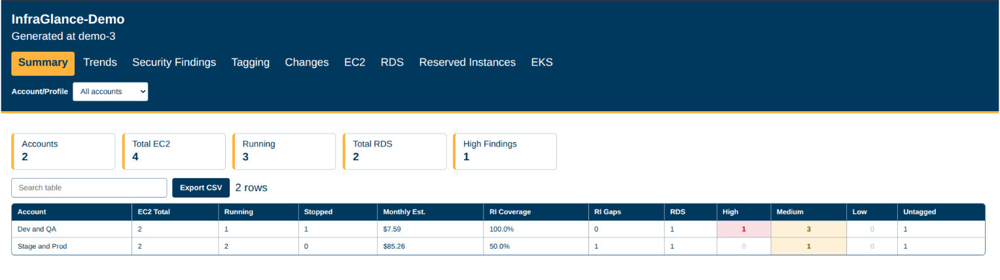
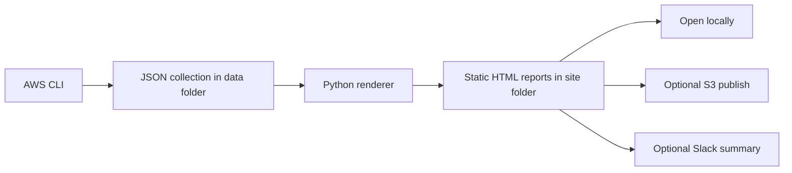

# InfraGlance

[](https://github.com/prasadtakale/InfraGlance/actions/workflows/ci.yml)
[](https://github.com/prasadtakale/InfraGlance/actions/workflows/nightly.yml)
[](LICENSE)

**Static AWS Infrastructure Dashboard for Multi-Account Visibility, Security Findings, Cost Signals, and GovCloud Reviews.**

InfraGlance scans your AWS accounts and generates a static HTML dashboard showing EC2, RDS, EKS, Reserved Instances, security findings, tag gaps, cost signals, trends, and infrastructure changes — organized by account, VPC, and environment. No server to run, no SaaS to sign up for. Just open the HTML file in a browser.

I built this because the AWS Console is fine for one-off lookups but terrible for getting a quick picture across multiple accounts. Trying to answer "what's actually running in prod right now, and is any of it publicly exposed?" shouldn't require fifteen browser tabs.



---

## Demo

Try the fake-data demo without AWS credentials:

```bash
python3 render_report.py \
  --title InfraGlance-Demo \
  --manifest examples/fake-data/manifest.tsv \
  --vpcs examples/fake-data/vpcs.tsv \
  --output-dir examples/sample-report \
  --generated-at demo \
  --pricing-file pricing.json \
  --required-tags Environment,Owner \
  --state-file examples/sample-report/infraglance-state.json
```

Then open:

```text
examples/sample-report/summary.html
```

The checked-in `examples/sample-report/` files are generated from fake data and are safe to browse or link from GitHub. Add screenshots or a short demo GIF under `docs/assets/` when publishing the repository page or project portfolio.

---

## Why InfraGlance?

| Tool | Best For | InfraGlance Difference |
|------|----------|------------------------|
| AWS Console | Manual resource lookup | InfraGlance gives a static cross-account view without clicking through services and accounts |
| AWS Config | Compliance recording and resource history | InfraGlance is lighter, cheaper to start with, and produces a shareable HTML report |
| Trusted Advisor | AWS best-practice checks | InfraGlance focuses on inventory, VPC grouping, cost signals, and report portability |
| Steampipe | SQL queries across cloud APIs | InfraGlance needs no database or query knowledge for basic visibility |
| CloudQuery | ETL into databases | InfraGlance avoids warehouse setup and produces static reports directly |
| Prowler / ScoutSuite | Deep security auditing | InfraGlance is a smaller day-to-day inventory and executive visibility layer |

InfraGlance is not a replacement for these tools. It is a fast, readable report layer for teams that need to understand what exists, what changed, what may cost money, and what needs review.

---

## Architecture



---

## What it does

Run `bash infraglance.sh` and it collects data from your configured accounts using the AWS CLI, then generates a folder of static HTML pages:

| Page | Contents |
|------|----------|
| `summary.html` | Cross-account overview — EC2 counts, estimated cost, RI coverage, security findings per account |
| `index.html` | EC2 inventory grouped by VPC, with cost estimates and RI coverage per instance |
| `rds.html` | RDS databases — engine, encryption status, Multi-AZ, public accessibility |
| `reserved.html` | Active Reserved Instances and which running EC2s are covered (or not) |
| `findings.html` | Auto-detected security issues — open security groups, unencrypted RDS, publicly accessible databases |
| `tags.html` | EC2 and RDS resources missing required tags |
| `changes.html` | What changed since the last scan — new, removed, or modified resources |
| `trends.html` | Line charts of EC2 count, cost, and findings over time |
| `eks.html` | EKS clusters and node groups, with Spot vs On-Demand breakdown |

Every table has search, column sort, and CSV export. The output is plain HTML with no external dependencies — it works offline and is safe to email or drop in S3.

---

## Setup

You need Bash 4+, Python 3.8+, and AWS CLI v2. No Python packages to install — the renderer uses only the standard library.

> **macOS note:** macOS ships Bash 3. Install a current version with `brew install bash`.

```bash
git clone https://github.com/prasadtakale/InfraGlance.git
cd InfraGlance
cp infraglance.conf.example infraglance.conf
```

Edit `infraglance.conf` to point at your AWS accounts, then verify your credentials before the first full run:

```bash
bash infraglance.sh --check
bash infraglance.sh
open site/index.html
```

The `--check` flag validates your credentials and regions without collecting any data. Worth running first if this is a new account or role.

Useful flags:

```bash
bash infraglance.sh --config ./infraglance.prod.conf
bash infraglance.sh --output-dir ./site-prod
bash infraglance.sh --work-dir ./data-prod
```

---

## IAM permissions

InfraGlance only needs read access. Attach this policy to whatever role or user it authenticates as:

```json
{
  "Version": "2012-10-17",
  "Statement": [
    {
      "Effect": "Allow",
      "Action": [
        "ec2:DescribeVpcs",
        "ec2:DescribeInstances",
        "ec2:DescribeSecurityGroups",
        "ec2:DescribeReservedInstances",
        "ec2:DescribeRegions",
        "rds:DescribeDBInstances",
        "eks:ListClusters",
        "eks:DescribeCluster",
        "eks:ListNodegroups",
        "eks:DescribeNodegroup",
        "sts:GetCallerIdentity"
      ],
      "Resource": "*"
    }
  ]
}
```

For cross-account scanning, the calling identity also needs `sts:AssumeRole`.

---

## Configuration

The config file covers accounts, regions, VPC grouping, cost settings, and a few optional features:

```bash
# Which AWS partition — auto detects from credentials, or set explicitly
PARTITION="auto"   # auto | aws | aws-us-gov

# Accounts to scan
ACCOUNTS=("prod" "staging" "shared")

ACCOUNT_prod_LABEL="Production"
ACCOUNT_prod_PROFILE="prod-profile"        # named AWS CLI profile
ACCOUNT_prod_ROLE_ARN=""                   # or assume a role instead
ACCOUNT_prod_REGIONS=("us-east-1" "us-west-2")

# VPCs are grouped by this tag automatically
ENVIRONMENT_TAG_KEY="Environment"

# Publish to S3 after each run (leave empty to skip)
S3_BUCKET="my-reports-bucket"

# Post a summary to Slack after each scan
SLACK_WEBHOOK_URL=""

# Tags that should be present on every EC2 and RDS resource
REQUIRED_TAGS="Environment,Owner,CostCenter"

# Redact sensitive fields before sharing reports externally
REDACT_PRIVATE_IPS="false"
REDACT_PUBLIC_IPS="false"
REDACT_INSTANCE_NAMES="false"
REDACT_DB_NAMES="false"
```

See [infraglance.conf.example](infraglance.conf.example) for the full reference with comments.

---

## Multi-account setup

Each account gets its own block of config variables. InfraGlance assumes roles as needed so you can scan accounts you don't have direct credentials for:

```bash
ACCOUNTS=("prod" "staging" "security")

ACCOUNT_prod_LABEL="Production"
ACCOUNT_prod_ROLE_ARN="arn:aws:iam::111122223333:role/infraglance-readonly"
ACCOUNT_prod_REGIONS=("us-east-1")

ACCOUNT_staging_LABEL="Staging"
ACCOUNT_staging_PROFILE="staging-cli-profile"
ACCOUNT_staging_REGIONS=("us-east-1" "us-west-2")

ACCOUNT_security_LABEL="Security"
ACCOUNT_security_ROLE_ARN="arn:aws:iam::444455556666:role/infraglance-readonly"
ACCOUNT_security_REGIONS=("auto")   # auto-discovers all enabled regions
```

---

## GovCloud

Set `PARTITION="aws-us-gov"` and InfraGlance restricts collection to `us-gov-west-1` and `us-gov-east-1` automatically. Role ARNs use the `arn:aws-us-gov:` prefix. The partition is validated against `sts:GetCallerIdentity` before any data is collected, so a misconfigured role fails immediately rather than silently collecting from the wrong environment.

The generated HTML has no CDN dependencies and makes no outbound requests — the report can be reviewed in an air-gapped environment or shared with auditors without any data leaving your control.

---

## Nightly runs

A GitHub Actions workflow is included at `.github/workflows/nightly.yml`. It runs at 02:00 UTC, assumes an IAM role via OIDC, pulls the previous history file from S3 (for trend graphs), runs the scan, and uploads the report. Required secrets: `AWS_ROLE_ARN`, `S3_BUCKET`, `SLACK_WEBHOOK_URL`.

---

## Roadmap

- Live cost estimation from the AWS Pricing API instead of the static `pricing.json`
- Per-environment cost breakdowns on the Summary page
- Lambda function inventory
- EBS volume age, encryption, unattached volume, and snapshot visibility
- ELB, ALB, and NLB inventory with public/private exposure
- IAM access findings for stale users, broad policies, and unused access keys
- S3 public bucket and bucket encryption review
- WAF association and coverage reporting
- NAT Gateway cost visibility by account and VPC
- Route 53 public hosted zone visibility
- RDS and EC2 rightsizing hints

---

## Contributing

The codebase is intentionally small — `infraglance.sh` handles AWS data collection and `render_report.py` does all the HTML generation. If you're adding a new resource type, the pattern is: collect raw JSON in the shell script, add a `load_*` function and page renderer in Python. Open an issue before starting on anything large.

---

## License

MIT
